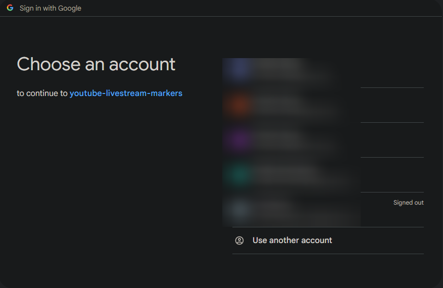
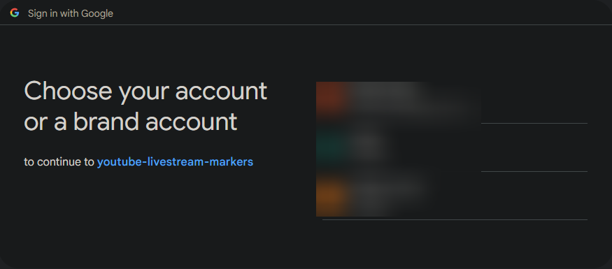
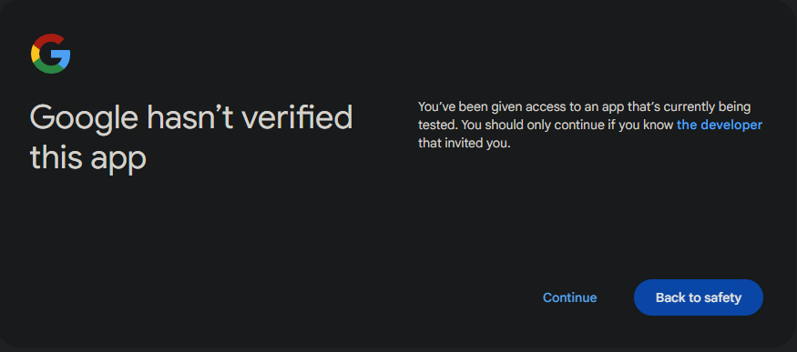
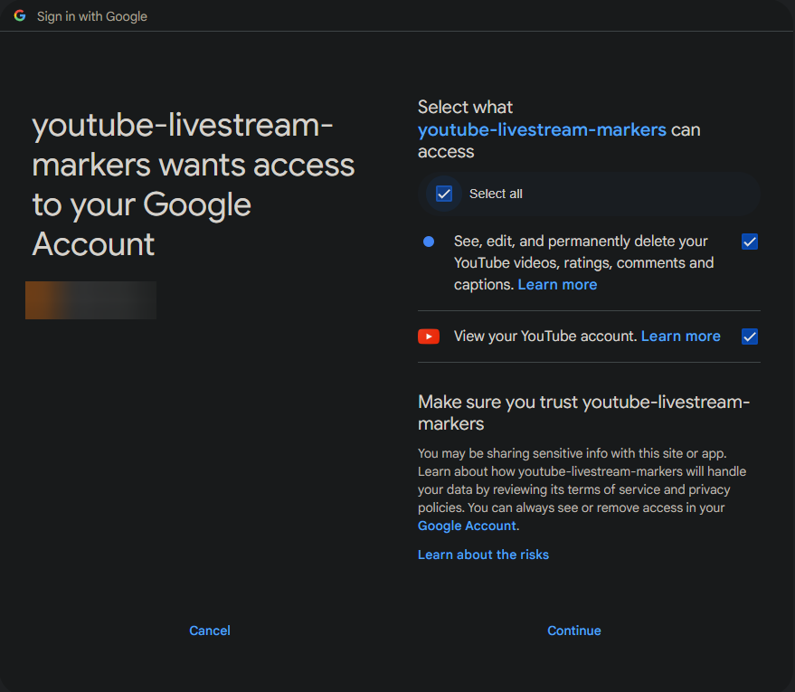

Add stream markers to youtube VOD description


# Setup
## Setup Youtube API
Create a Google Cloud Console project and now the project is selected

1. Enable YouTube Data API v3 in [Google Cloud console](https://console.cloud.google.com/apis/library)

2. Setup OAuth consent screen

    ### OAuth consent screen
    User Type
    - External
    App information
    - App name: NAME
    - User support email: Select the email associated with the project
    - Developer contact information: EMAIL

    ### Scopes
    Add the following scopes:
    ```
    .../auth/youtube.force-ssl
    ```

    ### Test users
    Add the email of the YouTube channel you want to add stream markers to

1. Create OAuth 2.0 client [credentials](https://console.cloud.google.com/apis/credentials?)

    Create credentials -> OAuth client ID
    - Application type: Desktop app

2. Download ouath credentials as json.

   Save it as `oauth_credentials.json`. Create a folder `.config` in top level fodler of the repo and place it there.

## Setup script with OBS Studio
1. Download source code in the latest release and extract it somewhere

2. In the toolbar at the top go to **Tools** -> **Scripts**

3. Press the plus sign and add the script `create_youtube_stream_markers.py`

4. Adjust your settings and set the path to your youtube api oauth credentials file from the last section.

# Usage
Once the script is setup, whenever you open your OBS it require you to log into your google account.

## Oauth login
- Select google account you plan on streaming to.



- Optional step if you have multiple Youtube accounts associated with the same email.



- Continue pass the "unverified app" page.



- Provide the script with permissions by checking the "Select all" box.



---

# Sources
- [Youtube Live Streaming API](https://developers.google.com/youtube/v3/live/docs/liveBroadcasts)

    Documents available hooks with the API and allows testing them in the website

- [Python sample code for youtube Live Streaming API](https://github.com/youtube/api-samples/blob/master/python/README.md)